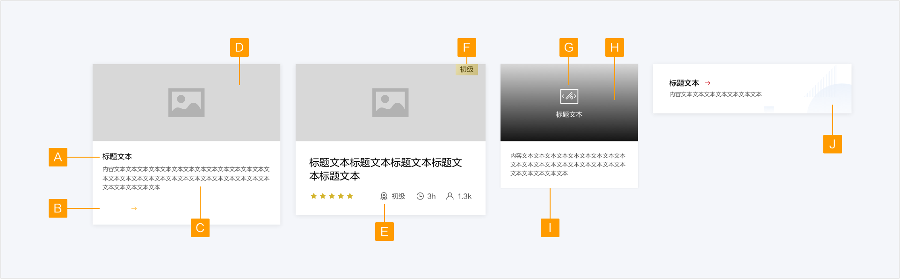
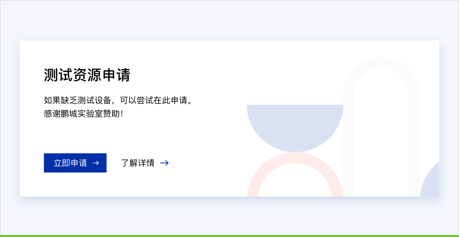
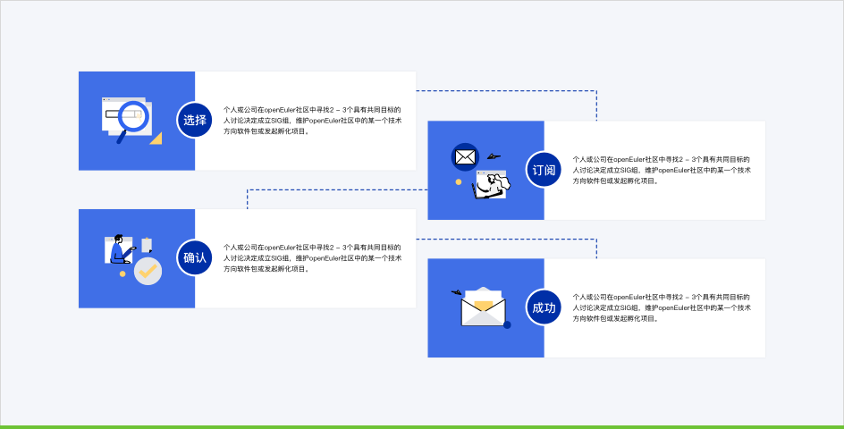
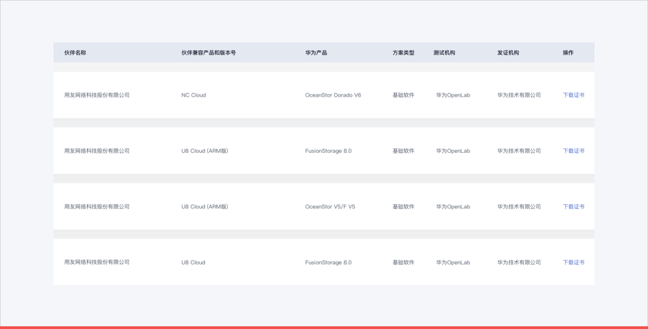
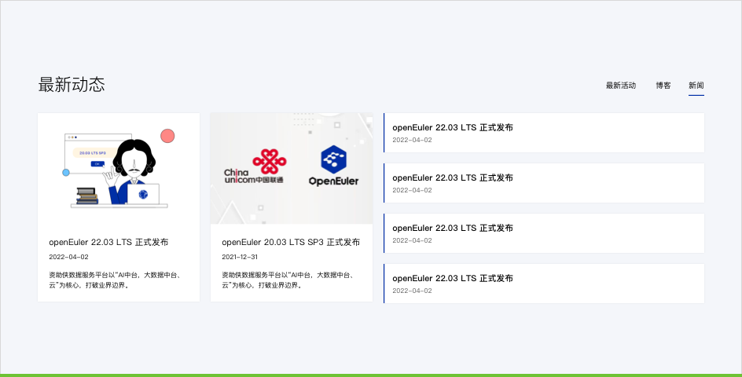
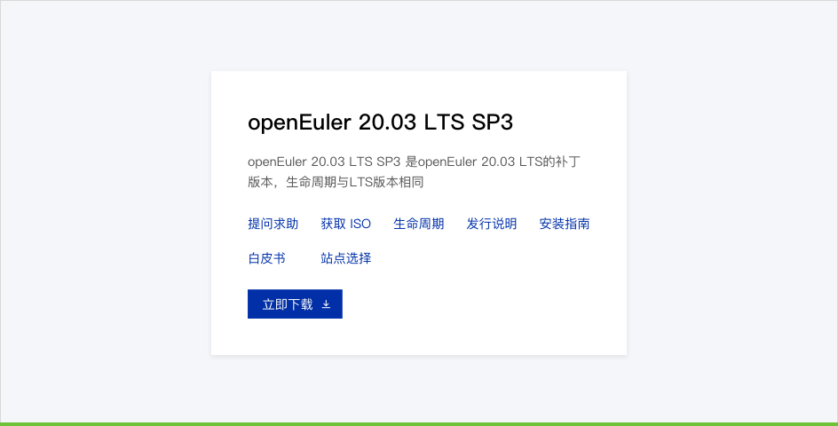
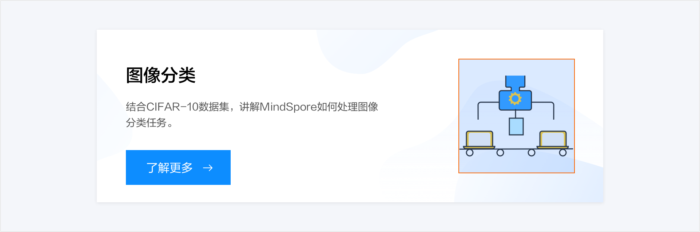
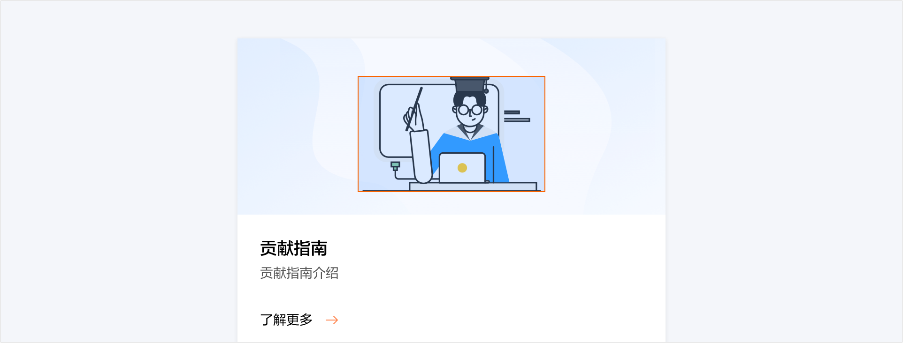
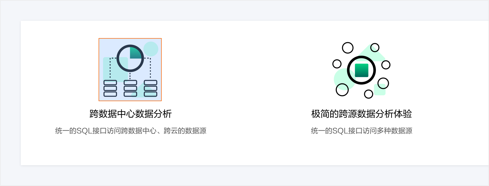
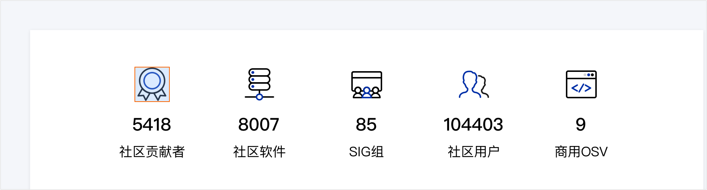

# 卡片

卡片将内容按逻辑进行分组，帮助用户快速获取信息和进行操作

## 组件元素

A.标题文本

B.按钮（可选）

C.内容文本（可选）

D.图片（可选）

E.统计数据（可选）

F.标签（可选）

G.图标（可选）

H.遮罩（可选）

I.卡片容器

J.背景插画（可选）

### 元素规则

#### 标题文本

标题文本应在卡片上显示完整，文本超长时换行显示，以防用户对内容产生误解。
#### 内容文本

内容文本尽量在卡片上显示完整，如有下级页面承载完整内容时可酌情用“…”省略。
#### 按钮

1. 按钮中的文本可以作为卡片操作提示语。
2. 多个按钮代表不同的操作行为时可以放置在同一卡片上。
#### 统计数据

使用场景：当卡片用于展示课程、实验等内容时，可以展示评分、时长、人数、等级等数据。

人数单位：1000人以下直接展示数字；1000人以上折换成单位k，并保留一位小数，如3540写作3.5k。

时长单位：不满30分钟时，按分钟计；超过（包括）30分钟时，转化为小时，并保留一位小数，如30分钟写作0.5小时。

##### 正确示范

一个卡片上承载了多个按钮时，强调按钮强调主要操作

## 如何使用

### 使用场景

1. 强调内容，帮助用户快速获取信息和进行操作。
2. 区分卡片内容信息，以避免元素所属关系的混乱。

##### 正确示范

信息需要引起用户的注意，或者需要让用户仔细阅读时适合使用卡片

##### 错误示范

在需要用户快速浏览内容时，使用卡片分割内容会增加用户的阅读时间成本

##### 正确示范

有图片、文本、功能按钮等多种元素时，卡片可用作组的分隔

##### 正确示范

当一组卡片内有不可点击的，建议添加按钮作为操作提示

<TheCard />

<!-- ----------------------- -->

## 卡片插画

卡片插画位置如图，尺寸为160x158

卡片插画位置如图，中间插画尺寸为124x124

二级插画位置如图，尺寸为124x124

三级插画位置如图，尺寸为80x80