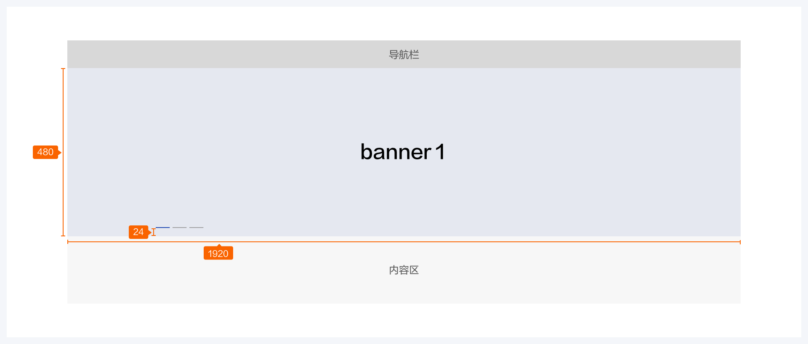
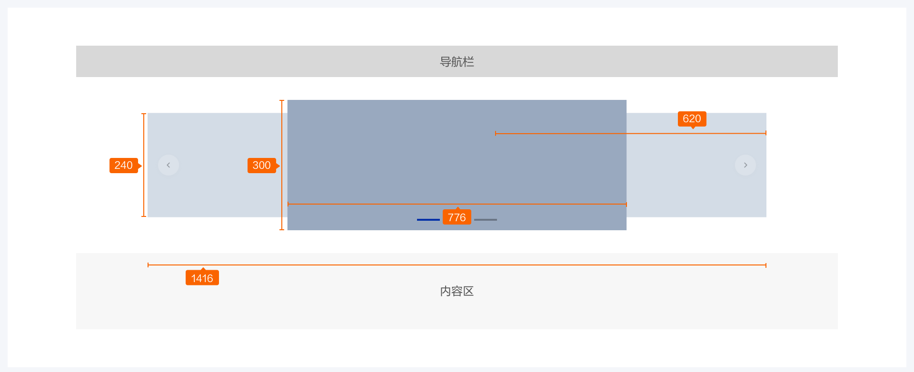

# 轮播

轮播允许多个内容同时在一个空间内并列展示

<!-- ## 组件展示

 -->

## 组件元素

A：进度条（用于首页一级轮播banner）

B：进度条（用于二级轮播banner）

### 元素规则

#### 进度条

1.进度条从左往右填充品牌色展示倒计时，轮播时长一般设置为3-7秒。

2.默认为自动轮播，也可由用户主动触发切换。

3.用户鼠标悬停在内容区时暂停轮播，鼠标移出内容区后重新计时一个轮播时长后切换到下个内容。

4.最多可展示5个图片轮播

## 尺寸规范

### 一级图片轮播框

轮播框组件最基本的使用

### 二级图片轮播框

当页面宽度方向空间空余，但高度方向空间匮乏时，可使用卡片风格

## 如何使用

### 使用场景

适用于banner切换或者信息展示楼层的轮换显示，轮播数量一般控制在3-5个之间为最佳。

##### 正确示范

进度条视觉样式较细，应放大热区以便于用户点击

##### 错误示范

轮播数量一般控制在3-5个之间为最佳。

