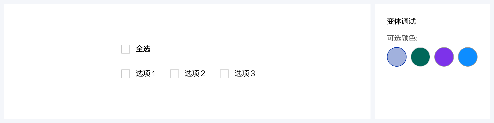
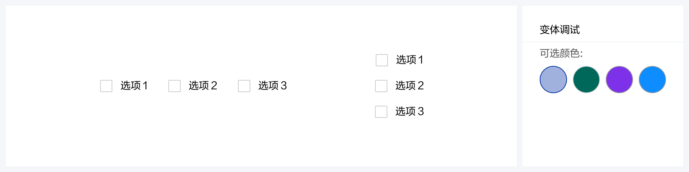

# 复选框

在备选项中选取多个目标选择

## 组件展示

## 组件元素

A.复选按钮

B.选项文本

### 元素规则

#### 选项文本

1.选项文本应尽量简洁。

2.选项数据须按一定的规则进行有效排列（字典排序、或选择频繁度、重要性）。

## 如何使用

### 使用场景

用户需要做多项选择时使用，一般用于表单页面信息输入、表格选择。

##### 使用规范：

1.文本宽度默认 60，超过 60 自适应，间距保持不变

2.一般默认所有选项可见，方便用户在比较中选择

3.对于暂不可用的按钮选项进行灰化处理

4.半选用于表示子选择中有被选中的

### 全选

在实现全选的功能时，可以通过 indeterminate 属性展示半选效果。

### 布局

使用 &lt;a-checkbox-group&gt; 传入 &lt;a-checkbox&gt;，配合 &lt;a-grid&gt; 组件实现灵活的布局。

