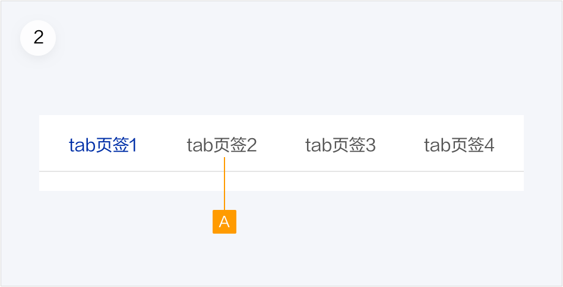

# 页签

页签用于多个同级内容的快速切换，同时保持页面简洁清晰

<!-- ## 组件展示

 -->

## 组件元素

页签有2种类型：一级页签、二级页签。

##### 1.一级页签

A.图标（可选）

B.页签文本

C.选中状态线

##### 2.二级页签

A.二级页签文本

### 元素规则

#### 页签文本

1.页签文字应简洁明了，让用户对切换后的内容有清晰的预知。

2.请勿使用标点符号，例如冒号或感叹号。

3.不能用型号、规格等作为页签文本来切换内容，如：大、中、小。

## 尺寸规范

### 卡片上的tab页签二级

#### 使用规则：

1.使用于卡片上，是二级tab，居中放置。

2.页签的华为线长度不得小于48px；如果文字长度大于48px，则华为线长度与文字同宽。

3.适应规则：页签文字间距为40px，tab页签个数超出显示范围时，左右增加箭头示意切换。如果两端有文字显示不全的tab，点击时应使文字显示完整。

## 如何使用

当内容需要分组，并在不同模块页面中展示，可使用 Tab 页签，页签中的标签卡条目应该相对平级。

### 一级页签

使用场景：既可用于单个楼层，也可用于整个页面的内容切换，切换的内容没有逻辑前后关系。用于整个页面时有置顶效果。

项数过多：当选项过多显示不全时，采用左右加箭头的形式。

### 二级页签

使用场景：当页面需要两层tab时使用，二级页签只使用于楼层内。

项数过多：当选项过多显示不全时，采用左右加箭头的形式。
